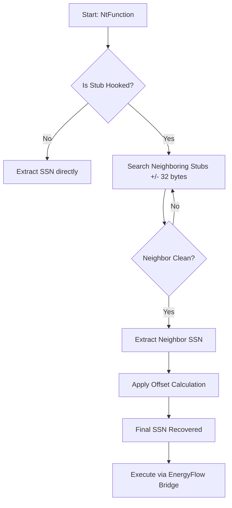

# 🛡️ OBLITERATUS - Halo's Gate Implementation
### Advanced EDR Bypass through Indirect Syscall Resolution

**Halo's Gate** is a refined evolution of the *Hell's Gate* technique. Its primary objective is to resolve System Service Numbers (SSNs) even when the target syscall is actively hooked and obfuscated by an EDR (Endpoint Detection and Response) solution.

---

## 🔬 The Problem: EDR User-Mode Hooking
Modern EDRs monitor sensitive Windows APIs by injecting a `JMP` instruction at the beginning of syscall stubs in `ntdll.dll`. 

#### Hooked Syscall Stub (Example):
```nasm
ntdll!NtProtectVirtualMemory:
    00007ff8`a1b2c3d0 e9 2b 4e 0d 00    jmp    edr_engine!hook_function
    00007ff8`a1b2c3d5 4c 8b d1          mov    r10,rcx
    00007ff8`a1b2c3d8 b8 50 00 00 00    mov    eax, 50h
```
In this state, the SSN (in this case, `0x50`) is still visible, but the execution flow is redirected. If the EDR overwrites the entire stub, the SSN is lost.

---

## ⚡ The Halo's Gate Solution
If a target syscall is hooked, OBLITERATUS searches for adjacent syscalls in memory (upwards and downwards). Since syscall numbers are usually sequential, we can reconstruct the target SSN by calculating the offset from a clean neighbor.

### 🔄 Resolution Flow


---

## 🛠️ Technical Implementation: `EnergyFlow`

The framework uses an Assembly bridge (`src/go/syscalls_amd64.s`) to execute the recovered SSN without triggering "Direct Syscall" detection, which is another common telemetry source for EDRs.

#### Indirect Syscall Logic:
Instead of calling `syscall` directly, we find a `syscall; ret` gadget within `ntdll.dll` and jump to it. This makes the execution look like it originated from the legitimate system library.

#### SSN Discovery (Go snippet):
```go
func res(n string) SPr {
    // ... load ntdll ...
    a := p.Addr()
    if id, ad := sc(a); ad != 0 { return SPr{id, ad} } // Direct check
    for i := 1; i < 32; i++ {
        // Search neighbors and adjust ID by index
        if id, ad := sc(a - uintptr(i*32)); ad != 0 { return SPr{id + uint32(i), ad} }
        if id, ad := sc(a + uintptr(i*32)); ad != 0 { return SPr{id - uint32(i), ad} }
    }
}
```

---

## 📊 Comparison: Signal Signature

| Feature | Direct WinAPI | Direct Syscalls | **Halo's Gate (OBLITERATUS)** |
| :--- | :--- | :--- | :--- |
| **Hook Detection** | 🔴 High | 🟡 Medium | 🟢 Zero |
| **Stack Hygiene** | 🟢 Clean | 🔴 Anomalous | 🟢 Clean |
| **Telemetry** | 🔴 Logged | 🟡 Static SSN | 🟢 Dynamic Reconstruction |
| **EDR Evasion** | ❌ None | 🟡 Basic | ✅ Elite |

---
*Documented for OBLITERATUS Red Teaming Framework.*
