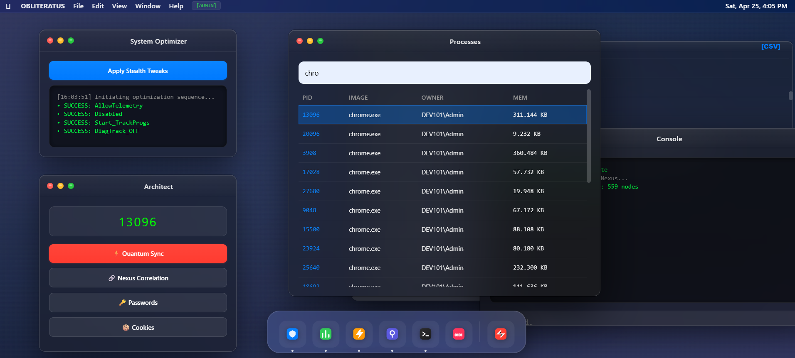

# 🌌 OBLITERATUS - Advanced Red Teaming Framework
### High-Fidelity Evasion & Identity Nexus Synchronization for Windows NT

<p align="center">
  
</p>


**OBLITERATUS** is a sophisticated security orchestration engine designed for advanced post-exploitation research and defensive evasion testing. It implements a multi-layered stealth architecture to minimize the "Signature of Intent" while performing deep forensic analysis and identity correlation across modern Windows environments.

---

## ⚡ Technical Core & Evasion Layer

### 🔬 Low-Level Execution Bridge (Halo's Gate)
- **Indirect Syscalls:** Custom ASM bridge (`EnergyFlow`) dynamically resolves System Service Numbers (SSNs) and identifies syscall gadgets within `ntdll.dll`. This bypasses EDR/AV user-mode hooks by executing instructions directly in memory.
- **Stack Hygiene:** Strict adherence to Windows x64 calling conventions and shadow space management to mitigate stack-based anomaly detection.

### 🛡️ Memory Hardening (W^X Strategy)
- **Phase Transitioning:** Eliminates the `RWX` (Read-Write-Execute) footprint. Memory pages are allocated as `PAGE_READWRITE` (0x04) during initial sync and transmuted to `PAGE_EXECUTE_READ` (0x20) using `NtProtectVirtualMemory` immediately before execution.
- **Handle Sanitization:** Precise lifecycle management via `NtClose`, preventing process-to-target linkage leakage in the kernel object table.

### 🧠 Identity Nexus & Intelligence
- **Semantic Correlation:** Advanced "Identity Nexus" module that performs a Bayesian-like join between session cookies and saved credentials. It identifies **Critical Compromise Nodes** where an active session matches a stored identity, bypassing MFA requirements.
- **App-Bound Research (v20):** Integrated COM-based suitor module that interacts with the `Google Chrome Elevation Service` (`IElevator`) to research bypasses for modern Chromium encrypted stores.
- **VFS Forensic Sanitization:** Utilizes memory-backed SQLite processing to perform triple-copy snapshots (DB+WAL+SHM) with zero disk persistence in `%TEMP%`.

### 🔒 Zero-Trust Orchestration
- **Ephemeral Tokenization:** All orchestration endpoints are shielded by a PID-based ephemeral token (`X-Signal-Token`), preventing unauthorized local process interference.
- **Handshake Protocol:** The C2 interface is hidden behind a simulated Apache 404 facade.
<p align="center">
  
  <br>
  <i>The system remains dormant behind a 404 facade until the specific interaction sequence (3-click handshake or F2) is executed.</i>
</p>

---

## 🖥️ Operational Interface (Master Console)
Featuring a **macOS-inspired Glassmorphism** UX/UI:
- **Architect Module:** Centralized node for process selection and signal synchronization.
- **Nexus Decrypter:** Real-time visualization of correlated credentials and active session tokens.
- **System Optimizer:** One-click kernel-level module to disable Windows Telemetry (`DiagTrack`) and Error Reporting (`WerSvc`).
- **Hex Live-Viewer:** Low-level buffer monitoring for payload integrity verification.

---

## 🚀 Deployment & Reconstruction

### Compilation Protocol
1.  **Environment:** Go 1.21+ required.
2.  **Dependency Sync:**
    ```powershell
    go mod tidy
    ```
3.  **Stealth Build:** 
    ```bash
    go build -ldflags="-s -w -H=windowsgui" -o bin/obliteratus.exe ./src/go
    ```

### Operational Use
Requires Administrator privileges for COM interface interaction and memory manipulation:
1. Run `bin/obliteratus.exe`.
2. Connect via `http://localhost:8080`.
3. Execute **Handshake Protocol** to initialize the signal.

---

## ⚠️ Disclaimer
**OBLITERATUS** is intended strictly for authorized security auditing, research, and educational purposes. The developer assumes no responsibility for unauthorized use. Accessing private data without explicit permission is illegal and unethical.

---
*Engineering Cyber-Resilience through Offensive Innovation.*
